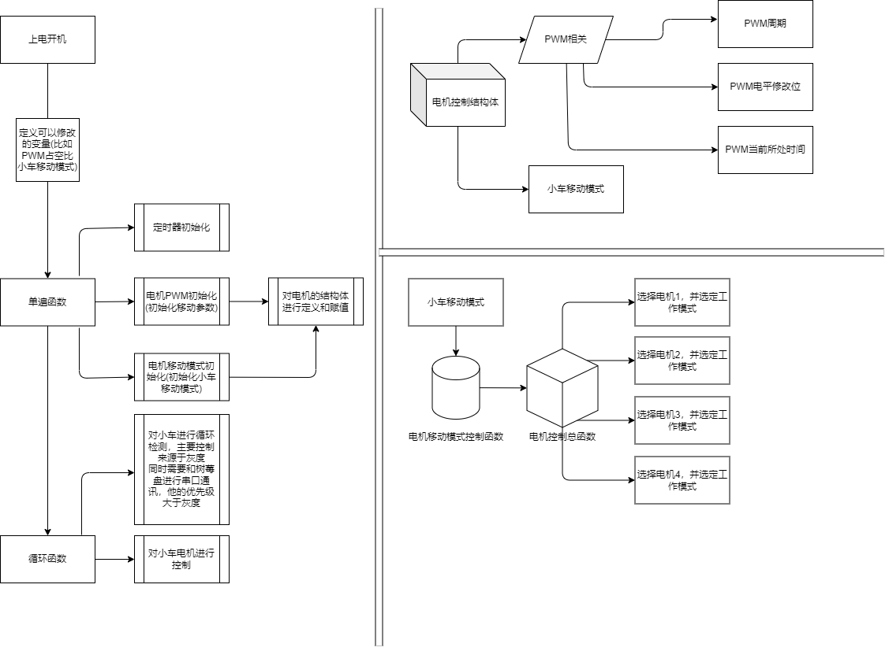

# STM32C8T6_Car

------

# 基于STM32C8T6的小车项目，用于光电比赛和电赛

------

## 1、程序大致的流程图

这张流程图简单的描述了小车控制程序的逻辑，可以对其进行更改和优化，但修改时不要破坏既有结构。

------

## 2、PCB

PCB主要用于电源板和STM32的链接，根据简单的测量进行的绘制和制作，可能会有误差的问题，包括焊接问题的产生，请谨慎使用

（详情请见PCB文件夹）

 
